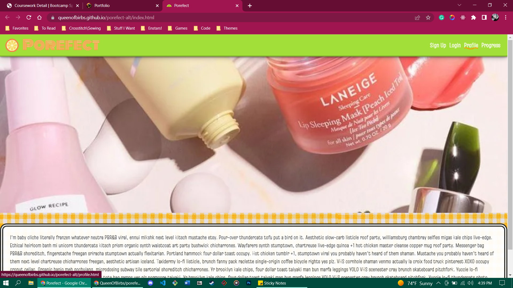

# Porefect Alt. Theme

## Description 

Here is a link to the deployed application on Github:

https://queenofbirbs.github.io/porefect-alt/index.html

My unused theme for Porefect! Includes brainstorming sketches and original page layouts!
Went for a bright/citrus vibe; shows off some custom buttons and many other fruit themed items. Not functional like the deployed app, this version is purely to show off the unused theme and nothing more.
<br>
<br>
<ul>
  <li>
Final deplyed app: https://porefect.herokuapp.com/
    <br>
Fully functional but using a different theme.
  </li>
  </ul>

[](https://opensource.org/licenses/MIT)

## Table of Contents
- [Installation](#installation)
- [Usage](#usage)
- [Contributing](#contributing)
- [License](#license)
- [Questions](#questions)

## Installation

To run this application locally make sure to copy the files and then run ```npm install``` to have all of the correct dependencies. Otherwise please follow the link in the description or above to try out the deployed version yourself!

## Usage

This is a group project assignment though feel free to look around and play with the app! Uses Bootstrap, Handlebars, Javaascript and Cloudinary for uploading photos. Made in May 2022.
Here is a screenshot of the application:




## Contributing

Isis Alexander (https://github.com/QueenOfBirbs)

## License

This application is covered under MIT license. 

## Questions

You can reach us at goddess.isis.alexander@gmail.com if you have any questions!

